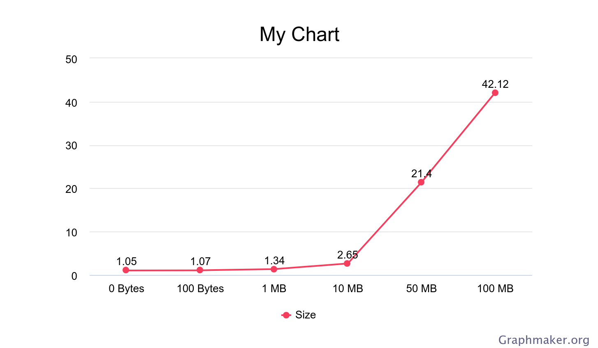

| Filesize (MB) | Time (s) |
|---------------|----------|
| 0 (≈1 byte)   | 1.05     |
| 0.0001 (100 B)| 1.07     |
| 1             | 1.34     |
| 10            | 2.65     |
| 50            | 21.04    |
| 100           | 42.12    |

The trend occurs because small files are dominated by fixed communication overhead, while larger files take longer as more chunks must be transferred.